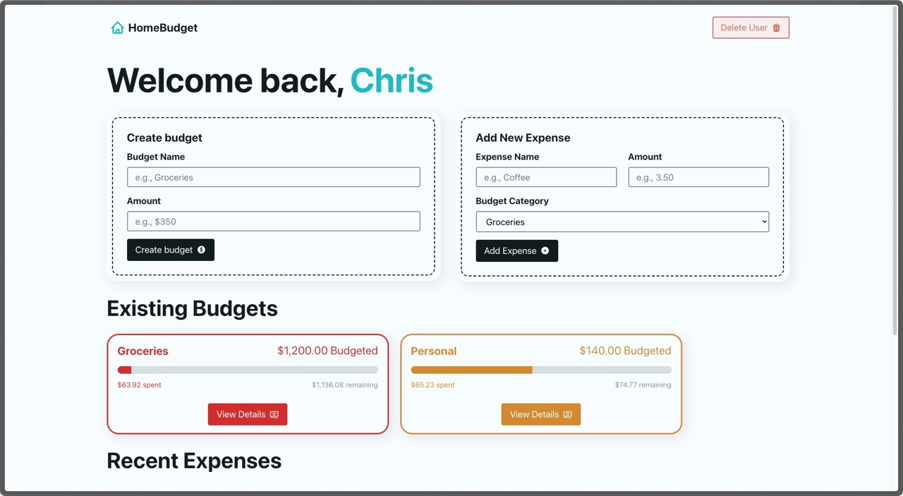
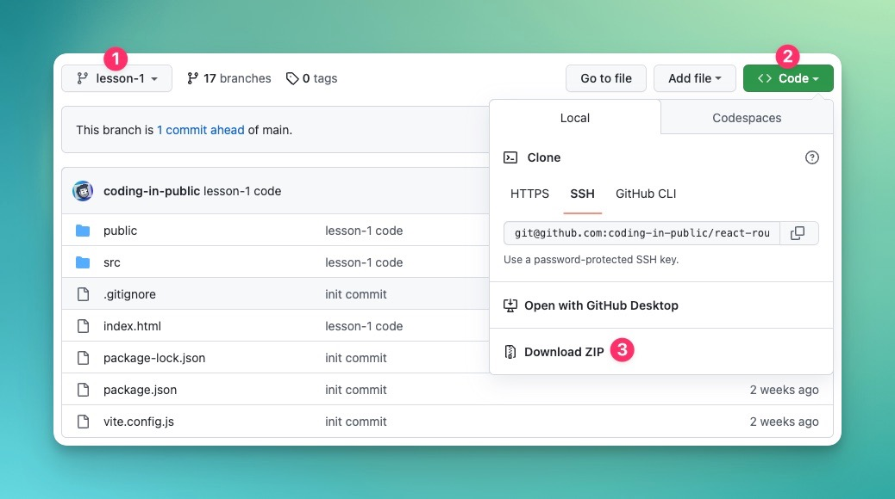

# React Router Budget App

During this course, we’ll build an interactive budget app using React Router 6.8 and local storage.

[Demo App](https://codinginpublic.dev/projects/react-router-budget-app/)

## Lesson Help
If you get stuck on any lesson in the series, navigate to the course branch for your current lesson (1) and view or download (2, 3) the code for more help.

## Assumptions
In this series, I’ll assume you have a working knowledge of both HTML, JavaScript, React, and React Router. If you need help, see the Net Ninja’s introductory series on any of these topics.

## Helpful Links:
- [My YouTube Channel](https://www.youtube.com/c/CodinginPublic)
- [Demo project](https://codinginpublic.dev/projects/react-router-budget-app/)

## Connect With Me
- Website: https://codinginpublic.dev
- Blog: https://chrispennington.blog
- Twitter: https://twitter.com/cpenned
- Patreon: https://www.patreon.com/coding_in_public
- Buy Me a Coffee: https://www.buymeacoffee.com/chrispennington
